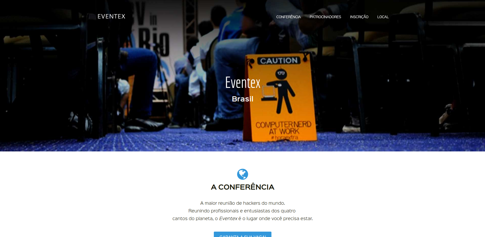

# Eventex [WTTD 2018](https://eventex-diemesleno.herokuapp.com)
> Landing page da Eventex desenvolvida durante o WTTD 2018. 

![PyPi][python-image]
![PyPi][status-image]
![Dockbit][deploy-image]
![Wercker][build-image]

So far, the landing page...

## Technologies utilized
* Python 3.6+
* dj-database-url 0.5.0
* dj-static 0.0.6
* Django 2.0.6
* python-decouple 3.1
* pytz 2018.4
* static3 0.7.0
* gunicorn 19.8.1
* psycopg2 2.7.4
* PostgreSQL 9.5+

## Public area


## Local Installation

Any Operating System:

```sh
mkvirtualenv eventex -p python3

cd eventex

pip install -r requeriments.txt

python migration

python manage.py createsuperuser

python manage.py runserver

access http://localhost:8000
```

## Release History

* 0.1.0
	* Initial release
* 0.0.7
	* DEV: Edition of `eventex/settings.py`
* 0.0.6
	* DEV: Edition of `eventex/urls.py`
* 0.0.5
	* DEV: Creation of `core/urls.py`
* 0.0.4
	* DEV: Development of `core/views.py`
* 0.0.3
	* DEV: Development of `core/model.py`
* 0.0.2
	* ADD: Creation of the app `core`
* 0.0.1
    * ADD: Creation of the project `eventex`

## Meta

Diemesleno Souza Carvalho – [@diemesleno](https://twitter.com/diemesleno) – diemesleno@gmail.com

Distributed under the ![AUR][gpl-image] license. 

[https://github.com/diemesleno/eventex](https://github.com/diemesleno/)

[python-image]: https://img.shields.io/pypi/pyversions/Django.svg?style=flat-square
[gpl-image]: https://img.shields.io/aur/license/yaourt.svg?style=flat-square
[status-image]: https://img.shields.io/pypi/status/Django.svg?style=flat-square
[build-image]: https://img.shields.io/wercker/ci/wercker/docs.svg
[deploy-image]: https://img.shields.io/dockbit/DockbitStatus/health.svg?token=TvavttxFHJ4qhnKstDxrvBXM&style=flat-square
